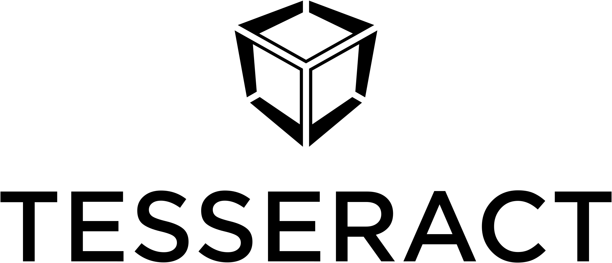

<p align="center">
	<a href="http://tesseract.one/">
		
	</a>
</p>


### [Tesseract](https://tesseract.one/) seamlessly integrates dApps and wallets, regardless of the blockchain protocol.

#### Tesseract aims to improve the usability of the dApps without compromising security or decentralization.

This page is about **Tesseract shared Core** in Rust and **Tesseract Rust APIs**. If you need general info or Tesseract for a specific platform, please consider one of the following:
* [General info](https://github.com/tesseract-one/)
* [Tesseract for iOS](https://github.com/tesseract-one/Tesseract.swift)
* [Tesseract for Android](https://github.com/tesseract-one/Tesseract.android)

## Getting started

First, make sure, please, you have followed the [installation](#installation) section steps. Here we describe how to start using Tesseract in your dApp. To make your wallet Tesseract-compatible, please refer to the [Wallet Documentation](./docs/SERVICE.MD) section.

### Initialize Tesseract Client

```rust
use tesseract_client;

let tesseract = tesseract_client::Tesseract::new(
	tesseract_client::delegate::SingleTransportDelegate::arc(),
).transport(/*your transport here*/);
```

### Select the Blockchain Network (i.e. Polkadot)

```rust
let service = tesseract.service(polkadot::Polkadot::Network);
```

### Call a method (i.e. sign transaction)

```rust
use polkadot::client::PolkadotService;

let signed = Arc::clone(&service).sign_transaction("testTransaction");
let signed = futures::executor::block_on(signed);

println!("Signed transaction: {}", signed.unwrap());
```

In the case of playground example, this snippet should print the following:
`Signed transaction: testTransaction_signed!`.

`sign_transaction("testTransaction")` is test method, that will be replaced once we have an actual implementation for Polkadot network.

## Installation

This section will get populated once we have the Rust implementation finished and the crates published. For now, please, consider checking out the Playground:
* Install your Rust environment: <https://www.rust-lang.org/tools/install>
* Clone this repo: `git clone https://github.com/tesseract-one/Tesseract.rs.git`
* Go to the playground `cd Tesseract.rs/tesseract-playground/`
* Run the playground `cargo +nightly run`

## Usage

The Tesseract Rust library is a Core implementation of Tesseract Protocol and thus provides all the necessary APIs for:
* dApp developers
* Wallet developers
* Blockchain protocol developers

The documentation is split into several sections respectively:
* [Tesseract Overview](#Background) - general info about how Tesseract Protocol works
* [Tesseract Client](./docs/CLIENT.MD) - for dApp developers
* [Tesseract Service](./docs/SERVICE.MD/) - for wallet developers
* [Tesseract Protocols (aka Blockchains)](./protocols/) - the list of supported protocols (i.e. Polkadot, Ethereum, etc.) and how to use them
* [Extending Tesseract](./EXTENDING.MD) - for Blockchain protocol developers

## Background

While there are plenty of options that allow dApps to interact with a wallet, there is no universal protocol that can cover required use cases and blockchain networks.

In contrast, Tesseract is designed highly flexible to solve the issues mentioned above:
* **Pluggable transport** - to support as many use cases as exist, Tesseract is not bound to a single connection type (i.e. Network, IPC, etc.). Instead, it provides Transport API, which allows to inject any type fo connection, based on the demands of the current and future use cases.
* **Pluggable Blockchains** - Tesseract is a Blockchain agnostic protocol. Instead of hard binding to a specific network, it provides a set of APIs that allow any Blockchain Network to add its set of calls to Tesseract.
* **Open Protocol** - Tesseract is open-source open protocol. Thus any wallet can implement Tesseract and provide its user-base with a possibility of dApps interaction.
* **Secure by Design** - Tesseract is designed in a way that it never needs access to the Private Keys, thus keeping security at the level provided by the wallet of choice.
* **Decentralized** - Tesseract does not need a central server to function, and does not need to store any user data or private keys on its servers.

## Roadmap

* [x] v0.1 - framework in Rust that implements all the concepts of Tesseract Protocol
	* [x] framework itself
	* [x] client API (for dApp develpers)
	* [x] service API (for Wallet developers)
	* [x] transports API (to create ways to communicate between dApps and Wallets, i.e. TCP/IP, IPC, etc.)
	* [x] protocols API (APIs to implement blockchain networks - i.e. Polkadot, Bitcoin, Ethereum, etc.)
	
* [x] v0.1.1 - Playground that implements mocks and tests all the frameworks concepts
* [x] v0.1.2 - restructured repo to provide **client** and **service** as features
* [x] v0.1.3 - **Test** protocol implementation (for testing the connection)

* [x] v0.2 - IPC transport - allows dApps and Wallets to communicate on the same device
	* [x] Android support
	* [x] iOS support

* [x] v0.3 - Polkadot network support
	* [x] in a separate branch
	* [x] merged

* [ ] v0.4 - demo applications
	* Android Wallet
	* Androif dApp
	* iOS Wallet
	* iOS dApps

* [ ] v0.5 - native language libraries (wrappers that provide native easy APIs for mobile developers)
	* [ ] Swift
	* [ ] Kotlin/Java

* [ ] v1.0 - first stable release

* [ ] v1.0+ - more transports and more blockchain networks
	* browser dApps
	* desktop dApps
	* various transports
	* more Blockchain Networks
	* more native language libraries (i.e. JS)

## Changelog

* v0.3 - Added Substrate support

* v0.2 - IPC transport - allows dApps and Wallets to communicate on the same device
	* Android support
	* iOS support

* v0.1.3 - added **Test** protocol implementation (for testing the connection)

* v0.1.2 - restructured repo to provide **client** and **service** as features

* v0.1.1 - added Playground that implements mocks and tests all the frameworks concepts

* v0.1 - framework in Rust that implements all the concepts of Tesseract Protocol
	* framework itself
	* client API (for dApp develpers)
	* service API (for Wallet developers)
	* transports API (to create ways to communicate between dApps and Wallets, i.e. TCP/IP, IPC, etc.)
	* protocols API (APIs to implement blockchain networks - i.e. Polkadot, Bitcoin, Ethereum, etc.)

## License

Tesseract.rs can be used, distributed and modified under [the Apache 2.0 license](LICENSE).


